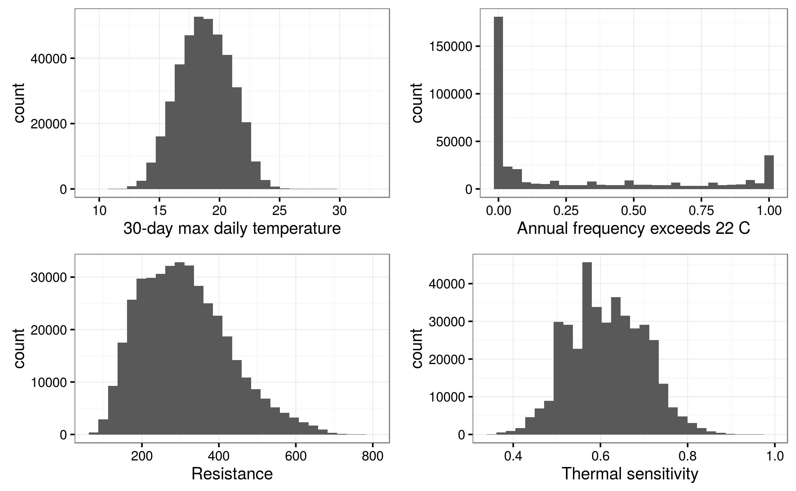

![Map of the mean annual maximum 30-day mean stream temperature (mean temperature during the warmest 30-day period each year). The inset shows how much local variation there is that is not clearly visible on the regional map. Gray areas have no predictions, usually because they are in larger streams, outside the bounds of the data used in the model (>200 $km^2$ drainage area). Results are presented as catchments delineated based on the stream reaches because at this scale stream lines would blend together and not provide a smooth visual map surface - *not sure if I need to include this, maybe wait to see if reviewers say anything*](Figures/Locations_Map.png) 

![Hierarchical structure of the daily stream temperature model. The observed daily temperatures are $t_{h,r,y,d}$ at HUC8 $h$ and reach $r$ in year $y$ on day $d$. In general, $\mu$ represent means, $\sigma$ represent standard deviations, $B$ represent vectors of coefficients with subscripts represnting the level of variation, $\Sigma$ is the covariance matrix, $\rho$ is the correlation matrix, $\omega$ is the expected temperature as a function of the deterministic components prior to inclusion of temporal autocorrelation, and $\delta$ is the autocorrelation coefficient. See details in the text for further description of the coefficients.](Figures/Hierarchical_Structure.pdf)

 

