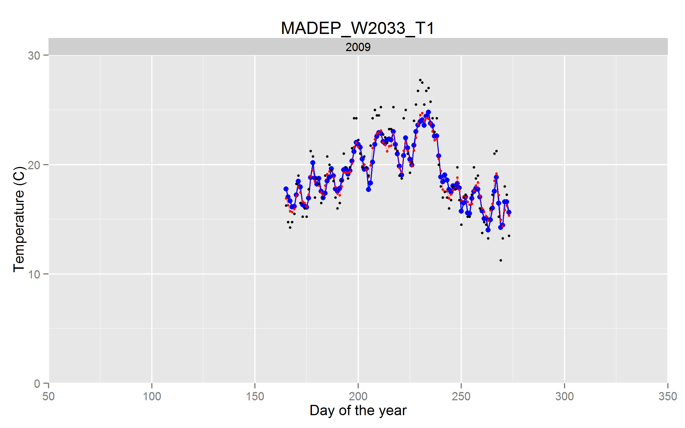

Daily model of stream temperature for regional predictions
=====================================

### Daniel J. Hocking, Ben Letcher, and Kyle O'Neil

*Daniel J. Hocking ([dhocking@usgs.gov](mailto:dhocking@usgs.gov)), US Geological Survey, Conte Anadromous Fish Research Center, Turners Falls, MA, USA

Abstract
--------

Set up the problem. Explain how you solve it. Tell what you find. Explain why it's the best thing ever.

Introduction
------------

**Options:** Water Research, **Water Resources Research**, Freshwater Biology, Journal of Hydrology, Ecohydrology, Journal of Environmental Quality, Hydrobiologia, JAWRA

Temperature is a critical factor in regulating the physical, chemical, and biological properties of streams. Warming stream temperatures decrease dissolved oxygen, decrease water density, and alter the circulation and stratification patterns of the stream (refs). Biogeochemical processes such as nitrogen and carbon cycling are also temperature dependent and affect primary production, decomposition, and eutrophication (refs). Both physical properties and biogeochemical processes influence the suitability for organisms living in and using the stream habitat beyond just primary producers. Additionally, temperature can have direct effects on the biota, especially ectotherms such as invertebrates, amphibians, and fish [e.g., @Kanno2013; @Xu2010; @Xu2010a; @Al-Chokhachy2013a]. Given commercial and recreational interests, there is a large body of literature describing the effects of temperature on fish, particularly the negative effects of warming temperatures on cool-water fishes such as salmonids . Finally, stream temperature can even affect electricity, drinking water, and recreation (see van Vliet et al 2011). Therefore, understanding and predicting stream temperatures are important for a multitude of stakeholders.

Stream temperature models can be used for explanatory purposes (understanding factors and mechanisms affecting temperature) and for prediction. Predictions can be spatial and temporal including forecasting and hindcasting. Predictions across space are especially valuable because there is often a need for information at locations with little or no observed temperature data. For example, many states have regulations related to the management of streams classified as cold, cool, and warm waters (refs), but because of the tremendous number of headwater streams it is impossible classify most streams based on observed data. Therefore, modeled stream temperature is needed to classify most streams for regulatory purposes. Forecasting can provide immediate information such as the expected temperature the next hour, day, or week as well as long-term information about expected temperatures months, years, and decades in the future. Hindcasting can be used to examine temperature variability and trends over time and for model validation. Both forecasting and hindcasting are useful for understanding climate change effects on stream temperature regimes.

Stream temperature models are generally divided into three categories: deterministic (also called process-based or mechanistic), stochastic, and statistical [@Chang2013; @Caissie2006; @Benyahya2007]. Deterministic models are based on heat transfer and are often modeled using energy budgets [@Benyahya2007; @Caissie2006]. The models require large amounts of detailed information on the physical properties of the stream and adjacent landscape as well as hydrology and meteorology. These models are useful for detailed site assessments and scenario testing. However, the data requirements prevent the models from being applied over large spatial extents.

Stochastic models attempt to combine pattern (seasonal and spatial trends) with the random deviations to describe and predict environmental data [@Chang2013; @Sura2006; @Kiraly2002]. Stochastic models of stream temperature generally rely on relationships between air and water temperature then with random noise and an autoregressive correlation, often decomposed by seasonal and annual components. These models are mostly commonly used to model daily temperature fluctuations because of their ability to address autocorrelation and approximate the near-random variability in environmental data [@Kiraly2002; @Caissie2001; @Ahmadi-Nedushan2007]. A limitation is that the physical processes driving temperature fluctuations are not elucidated with these models, they are used to describe features and patterns in a system and can therefore predict these patterns [@Kiraly2002]. Additionally, stochastic models rely on continuous, often long, time series from a single or a few locations. Inference cannot be made to other locations without assuming that the patterns and random deviations are similar at those locations.

As with stochastic models, statistical models generally rely on correlative relationships between air and water temperatures, but also typically include a variety of other predictor variables such as basin, landscape, and land-use characteristics. Statistical models are often linear with normally distributed error and therefore used at weekly or monthly time steps to avoid problems with temporal autocorrelation at shorter time steps (e.g. daily, hourly, sub-hourly). Parametric, nonlinear regression models have been developed to provide more information on mechanisms than traditional statistical models [@Mohseni1998]. Researchers have also developed geospatial regression models that account for spatial autocorrelation within dendritic stream networks [@Isaak2010b; @Peterson2010; @Peterson2013]. However, due to the complexity of the covariance structure of network geostatistical models, they are best used for modeling single temperature values across space (e.g. summer maximum, July mean, etc.) rather than daily temperatures [@Peterson2010; @Peterson2007; @VerHoef2010]. Additionally, statistical machine learning techniques such as artificial neural networks have been used to model stream temperatures when unclear interactions, nonlinearities, and spatial relationships are of concern [@Sivri2009; @Sivri2007; @DeWeber2014].

In contrast with deterministic approaches, statistical models require less detailed site-level data and therefore can be applied over greater spatial extents than process-based models. They also can describe the relationships between additional covariates and stream temperature, which is a limitation of stochastic models. These relationships can be used to understand and predict anthropogenic effects on stream temperature such as timber harvest, impervious development, and water control and release [@Webb2008]. Quantifying the relationship between anthropogenic effects, landscape characteristics, meteorological variables, and stream temperature allows for prediction to new sites and times using statistical models. This is advantageous for forecasting and hindcasting to predict and understand climate change effects on stream temperatures. This is critical because not all streams respond identically to air temperature changes and the idiosyncratic responses may be predicted based interactions of known factors such as flow, precipitation, forest cover, basin topology, impervious surfaces, soil characteristics, geology, and impoundments [@Webb2008].

We describe a novel statistical model of daily stream temperature that incorporates features of stochastic models and apply it to a large geographic area. This model handles time series data of widely varying duration from many sites using a mixed model approach to account for autocorrelation at specific locations within watersheds. It incorporates basin, landscape, land-use, and meteorological covariates for explanatory and predictive purposes. It includes an autoregressive function to account for temporal autocorrelation in the time series, a challenge with other statistical models at fine temporal resolution. Additionally, our hierarchical Bayesian approach readily allows for complete accounting of uncertainty. We use the model to predict daily stream temperature across the northeastern United States over a 34-year time record.

Methods
-------
### Study area

### Water temperature data

**Map of data locations: size = amount of data, color/shape = training-validation - Kyle, Ana, or Matt make? See deWeber 2014 for example**

### Meteorological (, Climatic,) and landscape data - separate landscape if use climate data for future projections

**Table of Variables** - include part of the model they're in (fixed, site, huc, year)

### Statistical model

Statistical models of stream temperature often rely on the close relationship between air temperature and water temperature. However, this relationship breaks down during the winter in temperature zones, particularly as streams freeze, thereby changing their thermal and properties. Many researchers and managers are interested in the non-winter effects of temperature. The winter period when phase change and ice cover alter the air-water relationship differs in both time (annually) and space. We developed an index of air-water synchrony so we can model the portion of the year that it not affected by freezing properties. The index is the difference between observed air and water temperatures divided by the water temperature plus 0.001??? to avoid division by zero. 

We then identified spring and autumn breakpoints based on the .... Independent breakpoints were estimated for each site-year combination. For site-years with insufficient data to generate continuous trends and confidence intervals, we used the mean break points across years for that site. If there was not sufficient local site information, we used the mean breakpoints from the smallest hydrologic unit the site is nested in (i.e. check for mean from HUC12, then HUC10, HUC8, etc.). More details regarding the identification of the synchronized period can be found in Letcher et al. (*in review*). 

We used a generalized linear mixed model to….

correlation in space

incorporate short time series as well as long time series from different sites

incorporate disjunct time series from sites

We assumed stream temperature measurements were normally distributed following,

but the expected mean temperature ($\mu_{s,h,d,y}$) is also adjusted based on the residual error from the previous day

\\[ \mu_{s,h,d,y} = \left\{
  \begin{array}{1 1}
    \omega_{s,h,d,y} + \delta_{s}(t_{s,h,d-1,y} - \omega_{s,h,d-1,y}) & \quad  \text{for $t_{s,h,d-1,y}$ is real} \\
    \omega_{s,h,d,y} & \quad  \text{for $t_{s,h,d-1,y}$ is not real}
  \end{array} \right.
 \\]

where $\delta_{s}$ is an autoregressive [AR(1)] coefficient that varies randomly by site and $\omega_{s,h,d,y}$ is the expected temperature before accounting for temporal autocorrelation in the error structure.

$X_{0}$ is the $n \times K_0$ matrix of predictor values. $B_0$ is the vector of $K_0$ coefficients, where $K_0$ is the number of fixed effects parameters including the overall intercept. We used 10 fixed effect parameters including the overall intercept. These include latitude, longitude, upstream drainage area, percent forest cover, elevation, surficial coarseness classification, percent wetland area, upstream impounded area, and an interaction of drainage area and air temperature. We assumed the following distributions and vague priors for the fixed effects coefficients

\\[ B_0 \sim \mathcal{N}(0,\sigma_{k_0}), \text{for $k_0 = 1,...,K_0$,} \\]

\\[ B_0 = \beta_{0}^{1},...,\beta_{0}^{K_{0}} \sim \mathcal{N}(0, 100) \\]

\\[ \sigma_{k_0} = 100 \\]

The effects of air temperature on the day of observation ($d$) and mean air temperature over the previous 5 days varied randomly with site nested within HUC8, as did precipitation, the previous 30-day precipitation mean, and the interactions of air temperature and preciptation (all 4 combinations).

$B_{s,h}$ is the $S \times K_{S}$ matrix of regression coefficients where $S$ is the number of unique sites and $K_{S}$ is the number of regression coeffcients that vary randomly by site within HUC8. We assumed prior distributions of

\\[ B_{s,h} \sim \mathcal{N}(0,\sigma_{k_{s}}), \text{for $k_{s} = 1,...,K_{S}$,} \\]

\\[ \sigma_{s_0} = 100 \\]

$X_{h}$ is the matrix of parameters that vary by HUC8. We allowed for correlation among the effects of these HUC8 coefficients as described by Gelman and Hill [-@Gelman2007].

$B_{h}$ is the $H \times K_{H}$ matrix of coefficients where $H$ is the number of HUC8 groups and $K_H$ is the number of paramaters that vary by HUC8 including a constant term. In our model, $K_{H} = K_{S}$ and we assumed priors distributions of

\\[ B_{h} \sim \mathcal{N}(M_{h},\Sigma_{B_{h}}), \text{for $h = 1,...,H$} \\]

where $M_{h}$ is a vector of length $K_{H}$ and $\Sigma_{B_{h}}$ is the $K_{H} \times K_{H}$ covariance matrix.

\\[ M_{h} \sim MVN(\mu_{1:K_h}^h, \sigma_{1:K_h}^h) \\]

\\[ \mu_{1}^h = 0; \mu_{2:K_h}^h \sim \mathcal{N}(0, 100) \\]

\\[ \Sigma_{B_{h}} \sim \text{Inv-Wishart}(diag(K_{h}), K_{h}+1) \\]

Similarly, we allowed the some effects of some parameters ($X_{y}$) to vary randomly by year with potential correlation among the coefficients. The intercept, day of the year ($day$), $day^2$, and $day^3$ all varied randomly with year so that $K_{y} = 4$. We assumed prior distributions of

\\[ B_{y} \sim \mathcal{N}(M_{y},\Sigma_{B_{y}}), \text{for $y = 1,...,Y$} \\]

where $M_{y}$ is a vector of length $K_{Y}$ and $\Sigma_{B_{y}}$ represents the $K_{Y} \times K_{Y}$ covariance matrix.

\\[ M_{y} \sim MVN(\mu_{1:K_y}^y, \sigma_{1:K_y}^y) \\]

\\[ \mu_{1}^y = 0; \mu_{2:K_y}^y \sim \mathcal{N}(0, 100) \\]

\\[ \Sigma_{B_{y}} \sim \text{Inv-Wishart}(diag(K_{y}), K_{y}+1) \\]

To estimate all the parameters and their uncertainties, we used a Bayesian analysis with a Gibbs sampler implemented in JAGS (ref) through R (ref) using the rjags package (ref). This approach was beneficial for hierarchical model flexibility and tractibility for large datasets. We used vauge priors for all parameters so all inferences would be based almost entirely on the data.

### Model validation

### Derived metrics

### Climate change projections (future paper?)

Results
-------

Explain what you found. Avoid blind *P-values* (or avoid *P-values* altogether)

Discussion
----------

what we found

model separates uncertainty in estimates and predictions from variability across space and time. The random site, HUC, and year effects explicitly address spatial and temporal variability, allowing for more proper accounting of uncertainty.

lots of sensors because relatively cheap and easy to collect, but varying lengths of time at different sites. Our model incorporates sites with any length of time (a few days to decades). Sites will little data contribute less to the model but do provide some local and spatial information. The more data a location has the more informative so there is less shrinkage to the mean values. Sites with no data can be predicted based on covariate values and HUC-level random effects but do not get site-specific coefficient effects.

Disagreement (conflicting evidence? confused terminology) regarding the drivers of stream temperature

Acknowledgements
----------------
Thanks to Ethan White, Karthik Ram, Carl Boettiger, Ben Morris, and [Software Carpentry](http://software-carpentry.org/) for getting me started with the skills needed to [ditch MS Word](http://inundata.org/2012/12/04/how-to-ditch-word/) and produce more reproducible research.

Tables
------

Table 1: Example Markdown table

+--------------+-------+-----+---------+--------+------------+
|Name          |col2   |col3 |col4     |col5    |Comments    |
+==============+=======+=====+=========+========+============+
|Brook Trout   |1      |big  |few      |2.2     |Ecology &   |
|              |       |     |         |        |life history|
|              |       |     |         |        |data        |
|              |       |     |         |        |associated  |
|              |       |     |         |        |with trout  |
+--------------+-------+-----+---------+--------+------------+
|*Desmognathus*|100    |small|many     |0.3     |Widespread  |
|*fuscus*      |       |     |         |        |salamander  |
|              |       |     |         |        |species     |
+--------------+-------+-----+---------+--------+------------+

| Name | Phone |
| ---- | ----- |
|      |       |

Figures
-------

Figure 1. Example of adding a figure.

Literature Cited
----------------